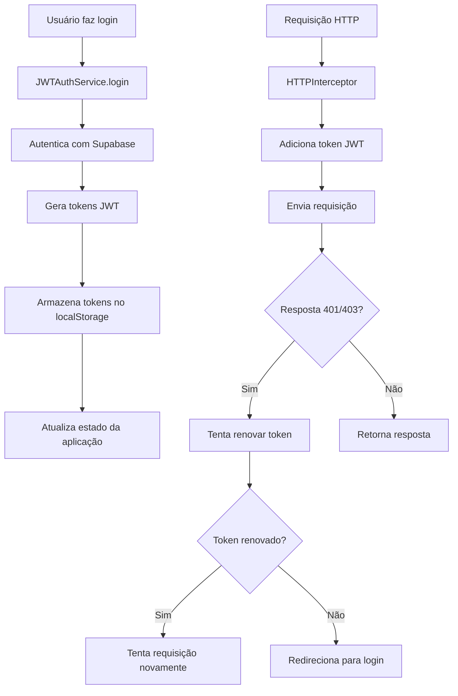

# Integração JWT - WorldRental Felix Mix

## 📋 Visão Geral

Este documento descreve a integração JWT implementada no sistema WorldRental Felix Mix. A integração mantém a compatibilidade com o Supabase Auth, mas adiciona uma camada JWT personalizada para maior controle sobre a autenticação.

## 🔑 Chave JWT

A chave JWT utilizada é:
```
O385WpSuerqzLGGcKEPR4YOP+50LJ9ABnp9LCXX8pZivZlucyX8Alo3C66Quh/Z0+jJv4mcsY35YZ0KZhVnQ6Q==
```

## 🏗️ Arquitetura

### Componentes Principais

1. **`src/lib/jwt-utils.ts`** - Utilitários para manipulação de JWT
2. **`src/lib/jwt-auth-service.ts`** - Serviço de autenticação JWT
3. **`src/lib/http-interceptor.ts`** - Interceptor HTTP para incluir tokens automaticamente
4. **`src/lib/jwt-hooks.ts`** - Hooks React para usar JWT
5. **`src/lib/auth.tsx`** - Context de autenticação atualizado

### Fluxo de Autenticação



## 🚀 Funcionalidades Implementadas

### 1. Geração e Verificação de Tokens

```typescript
import { generateJWT, verifyJWT } from '../lib/jwt-utils'

// Gerar token (async)
const token = await generateJWT({
  userId: 'user123',
  email: 'user@example.com',
  companyId: 'company123'
})

// Verificar token (async)
const payload = await verifyJWT(token)
```

### 2. Serviço de Autenticação

```typescript
import { JWTAuthService } from '../lib/jwt-auth-service'

// Login
const result = await JWTAuthService.login({
  email: 'user@example.com',
  password: 'password123'
})

// Cadastro
const signupResult = await JWTAuthService.signUp({
  email: 'new@example.com',
  password: 'password123',
  fullName: 'João Silva'
})

// Renovar token
const refreshResult = await JWTAuthService.refreshToken()
```

### 3. Interceptor HTTP

```typescript
import { HTTPInterceptor } from '../lib/http-interceptor'

// Requisição com token JWT automático
const response = await HTTPInterceptor.fetch('/api/protected', {
  method: 'GET'
})
```

### 4. Hooks React

```typescript
import { useJWT, useJWTUser } from '../lib/jwt-hooks'

function MyComponent() {
  const { jwtUser, getToken, isAuthenticated } = useJWT()
  const { userId, email, companyId } = useJWTUser()
  
  return (
    <div>
      <p>Usuário: {email}</p>
      <p>Autenticado: {isAuthenticated() ? 'Sim' : 'Não'}</p>
    </div>
  )
}
```

## 🔧 Configuração

### 1. Dependências Instaladas

```json
{
  "jose": "^5.0.0"
}
```

**Nota**: Utilizamos a biblioteca `jose` em vez de `jsonwebtoken` para compatibilidade total com navegadores.

### 2. Variáveis de Ambiente

As seguintes variáveis devem estar configuradas:

```env
VITE_SUPABASE_URL=your_supabase_url
VITE_SUPABASE_ANON_KEY=your_supabase_anon_key
```

### 3. Estrutura do Token JWT

```typescript
interface JWTPayload {
  userId: string      // ID do usuário no Supabase
  email: string       // Email do usuário
  companyId?: string  // ID da empresa (opcional)
  fullName?: string   // Nome completo (opcional)
  iat: number         // Timestamp de criação
  exp: number         // Timestamp de expiração
}
```

## 📱 Uso em Componentes

### Login com JWT

```typescript
import { useAuth } from '../lib/auth-hooks'

function LoginComponent() {
  const { signIn } = useAuth()
  
  const handleLogin = async (email: string, password: string) => {
    try {
      await signIn(email, password)
      // Login realizado com sucesso
    } catch (error) {
      console.error('Erro no login:', error)
    }
  }
}
```

### Verificação de Autenticação

```typescript
import { useJWTUser } from '../lib/jwt-hooks'

function ProtectedComponent() {
  const { isAuthenticated, userId } = useJWTUser()
  
  if (!isAuthenticated) {
    return <div>Usuário não autenticado</div>
  }
  
  return <div>Conteúdo protegido para usuário {userId}</div>
}
```

### Requisições Autenticadas

```typescript
import { HTTPInterceptor } from '../lib/http-interceptor'

async function fetchUserData() {
  try {
    const response = await HTTPInterceptor.fetch('/api/user-data')
    const data = await response.json()
    return data
  } catch (error) {
    console.error('Erro ao buscar dados:', error)
  }
}
```

## 🔒 Segurança

### 1. Expiração de Tokens

- **Token de acesso**: 24 horas
- **Refresh token**: 7 dias

### 2. Renovação Automática

O sistema automaticamente renova tokens expirados quando:
- Uma requisição retorna 401/403
- O refresh token ainda é válido

### 3. Armazenamento Seguro

- Tokens são armazenados no `localStorage`
- Tokens são incluídos automaticamente nas requisições HTTP
- Logout remove todos os tokens

## 🐛 Troubleshooting

### Problema: Token expirado

**Solução**: O sistema automaticamente tenta renovar o token. Se falhar, redireciona para login.

### Problema: Erro de verificação JWT

**Verificações**:
1. Confirme se a chave JWT está correta
2. Verifique se o token não está corrompido
3. Confirme se o token não expirou

### Problema: Requisições não incluem token

**Solução**: Use `HTTPInterceptor.fetch()` em vez de `fetch()` padrão.

## 📊 Monitoramento

### Logs Importantes

```typescript
// Habilitar logs de debug
console.log('JWT Token:', JWTAuthService.getToken())
console.log('Usuário JWT:', JWTAuthService.getCurrentUser())
console.log('Autenticado:', JWTAuthService.isAuthenticated())
```

### Métricas de Performance

- Tempo de geração de tokens
- Taxa de renovação de tokens
- Erros de autenticação

## 🔄 Migração

### De Supabase Auth para JWT

A integração mantém compatibilidade com o sistema atual:

1. **Login**: Funciona com ambos os sistemas
2. **Cadastro**: Funciona com ambos os sistemas  
3. **Logout**: Limpa ambos os tokens
4. **Proteção de rotas**: Verifica ambos os sistemas

### Rollback

Para voltar ao sistema anterior, simplesmente remova as chamadas JWT e mantenha apenas o Supabase Auth.

## 📚 Exemplos Completos

Veja o arquivo `src/examples/jwt-usage.ts` para exemplos detalhados de uso.

## 🎯 Próximos Passos

1. **Middleware de API**: Implementar validação JWT no backend
2. **Refresh automático**: Melhorar lógica de renovação
3. **Métricas**: Adicionar monitoramento de performance
4. **Testes**: Implementar testes unitários para JWT

---

**Nota**: Esta integração JWT foi implementada mantendo total compatibilidade com o sistema Supabase Auth existente, garantindo que não há quebra de funcionalidades.
