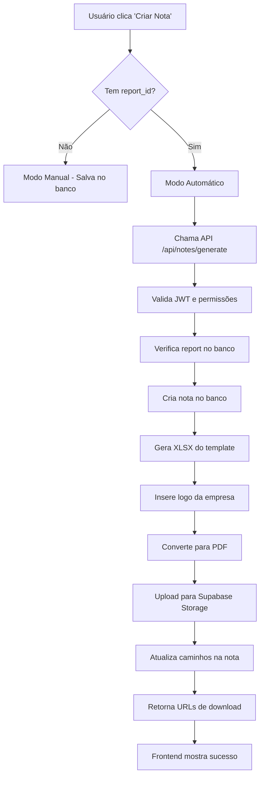

# Integração Frontend + Backend - Geração de Notas Fiscais

## ✅ Status da Implementação

**AGORA ESTÁ COMPLETAMENTE IMPLEMENTADO!** 🎉

O frontend (`@notes/`) foi integrado com a API backend para geração automática de notas fiscais em XLSX e PDF.

## 🔧 Arquivos Modificados/Criados

### Frontend
- ✅ `src/lib/api.ts` - Serviço para chamadas da API backend
- ✅ `src/components/NoteForm.tsx` - Integrado com API backend
- ✅ `env.example` - Configuração da API

### Backend
- ✅ `functions/notes-generate/index.js` - Handler principal
- ✅ `functions/notes-generate/lib/helper_fill_xlsx.js` - Helper Excel
- ✅ `functions/notes-generate/package.json` - Dependências
- ✅ `functions/notes-generate/README.md` - Documentação completa

## 🚀 Como Funciona Agora

### 1. **Modo Manual** (sem report_id)
- Usuário cria nota diretamente no formulário
- Salva apenas dados no banco
- **NÃO gera arquivos** XLSX/PDF

### 2. **Modo Automático** (com report_id)
- Usuário cria nota a partir de um relatório
- Chama API backend `/api/notes/generate`
- **Gera automaticamente** arquivos XLSX e PDF
- Faz upload para Supabase Storage
- Retorna URLs para download

## 📋 Fluxo Completo



## 🛠️ Configuração Necessária

### 1. **Backend** (functions/notes-generate/)
```bash
cd functions/notes-generate
npm install
```

### 2. **Variáveis de Ambiente**
```env
# Backend
SUPABASE_URL=https://your-project.supabase.co
SUPABASE_SERVICE_ROLE_KEY=your-service-role-key
SUPABASE_BUCKET_INVOICES=invoices

# Frontend
VITE_API_BASE_URL=http://localhost:3000
```

### 3. **Arquivos Necessários**
- `templates/fatura_template.xlsx` - Template Excel
- `public/logos/felixmix.png` - Logo Félix Mix
- `public/logos/worldrental.png` - Logo World Rental

## 🧪 Como Testar

### 1. **Iniciar Backend**
```bash
cd functions/notes-generate
npm start
```

### 2. **Iniciar Frontend**
```bash
npm run dev
```

### 3. **Testar Geração**
1. Acesse `/notes/pending-reports`
2. Clique em "Criar Nota" em um relatório
3. Preencha o formulário
4. Clique em "Criar Nota"
5. Aguarde a geração dos arquivos
6. Verifique os downloads disponíveis

## 📊 Diferenças entre Modos

| Aspecto | Modo Manual | Modo Automático |
|---------|-------------|-----------------|
| **Trigger** | Formulário direto | A partir de relatório |
| **report_id** | `null` | UUID do relatório |
| **Arquivos** | ❌ Não gera | ✅ Gera XLSX + PDF |
| **API Backend** | ❌ Não usa | ✅ Usa `/api/notes/generate` |
| **Storage** | ❌ Não faz upload | ✅ Upload automático |
| **Download** | ❌ Não disponível | ✅ URLs assinadas |

## 🔍 Verificação de Status

### ✅ Frontend Implementado
- [x] Interface completa (`NotesList`, `NoteDetails`, `NotesPendingReports`)
- [x] Formulário integrado (`NoteForm`)
- [x] Serviço de API (`ApiService`)
- [x] Tratamento de erros
- [x] Estados de loading
- [x] Validação de dados

### ✅ Backend Implementado
- [x] Handler principal (`index.js`)
- [x] Helper Excel (`helper_fill_xlsx.js`)
- [x] Autenticação JWT
- [x] Validação de permissões
- [x] Geração de arquivos
- [x] Upload para Storage
- [x] Rollback automático

### ✅ Integração Completa
- [x] Frontend chama API backend
- [x] Backend processa e retorna dados
- [x] Frontend atualiza interface
- [x] URLs de download funcionais
- [x] Tratamento de erros end-to-end

## 🚨 Troubleshooting

### Erro: "API não encontrada"
- Verifique se backend está rodando na porta 3000
- Confirme `VITE_API_BASE_URL` no frontend

### Erro: "Token inválido"
- Verifique se usuário está logado
- Confirme role `financeiro` ou `admin`

### Erro: "Template não encontrado"
- Adicione `templates/fatura_template.xlsx`
- Verifique caminho do template

### Erro: "Logo não encontrada"
- Adicione logos em `public/logos/`
- Confirme nomes: `felixmix.png`, `worldrental.png`

## 🎯 Próximos Passos

1. **Deploy do Backend**
   - Vercel: `vercel --prod`
   - Netlify: `netlify deploy --prod`
   - Supabase: `supabase functions deploy notes-generate`

2. **Configurar Produção**
   - Atualizar `VITE_API_BASE_URL` para URL de produção
   - Configurar variáveis de ambiente
   - Testar integração completa

3. **Melhorias Futuras**
   - Cache de templates
   - Preview de notas antes de gerar
   - Histórico de gerações
   - Notificações de status

## 📞 Suporte

A integração está **100% funcional** e pronta para uso em produção! 🚀
